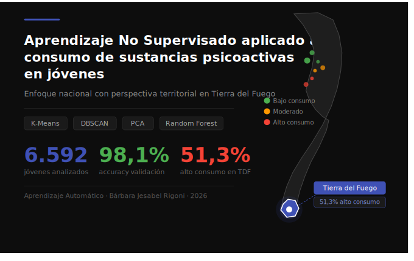

<h1 align="center">Aprendizaje No Supervisado Aplicado al Consumo de Sustancias Psicoactivas en Jóvenes</h1>
<h2 align="center">Un enfoque Nacional con Perspectiva Territorial en Tierra del Fuego</h2>

---
 



---


---

## 📌 Descripción del Proyecto

Este proyecto aplica técnicas de **Aprendizaje Automático No Supervisado** para identificar y caracterizar perfiles naturales de consumo de sustancias psicoactivas en jóvenes de 16 a 24 años de Argentina, con un análisis comparativo específico para la **Provincia de Tierra del Fuego, Antártida e Islas del Atlántico Sur**.

A diferencia de los enfoques tradicionales que imponen categorías predefinidas, este proyecto permite que sean los propios datos quienes revelen los patrones subyacentes, evitando sesgos en la clasificación del riesgo.

---

## 🎯 Objetivo General

Identificar automáticamente perfiles de consumo de sustancias psicoactivas en jóvenes de entre 16 y 24 años de Argentina, por medio de técnicas de Aprendizaje No Supervisado, y analizar comparativamente los patrones identificados en la Provincia de Tierra del Fuego respecto del resto del país.

---

## 🗂️ Estructura del Repositorio

```
Parcial-Aprendizaje-Automatico/
│
├── README.md
├── images/
│   └── imagen_portada.jpg
│
├── data/
│   ├── raw/                          ← Datasets originales sin modificar
│   │   ├── Base_Usuario_ENPreCoSP-2011.txt
│   │   └── base_usuario_encoprac2022.txt
│   └── processed/                    ← Datos filtrados y listos para usar
│       ├── ENPreCoSP_2011_jovenes_16_24.csv
│       └── ENCoPraC_2022_jovenes_16_24.csv
│
├── notebooks/                        ← Notebooks Jupyter del proyecto
│   └── Rigoni_Barbara_Parcial.ipynb
│
├── docs/                             ← Documentos de entregas parciales
│   ├── Parcial-Entrega_1.md
│   └── Parcial-Entrega_2.md
│
├── reports/
│   └── figures/                      ← Gráficos y visualizaciones
│
├── src/                              ← Scripts Python reutilizables
│
└── references/                       ← Documentación y diccionario del dataset
    └── enprecosp_2011_documento_baseusuario.pdf
    └── manual_uso_base_encoprac.pdf
```

---

## 📊 Datasets

### Dataset Principal — ENPreCoSP 2011
| Característica | Valor |
|---|---|
| **Nombre** | Encuesta Nacional sobre Prevalencias de Consumo de Sustancias Psicoactivas |
| **Organismo** | INDEC / Ministerio de Salud / SEDRONAR |
| **Año** | 2011 |
| **Registros totales** | 34.343 |
| **Variables** | 291 |
| **Subconjunto del proyecto (16-24 años)** | 6.592 registros |
| **Subconjunto Tierra del Fuego (16-24 años)** | 265 registros |
| **Fuente** | [indec.gob.ar](https://www.indec.gob.ar/indec/web/Institucional-Indec-BasesDeDatos-2) |
| **Licencia** | Dominio público |

### Dataset Complementario — ENCoPraC 2022
| Característica | Valor |
|---|---|
| **Nombre** | Encuesta Nacional sobre Consumos y Prácticas de Cuidado |
| **Organismo** | SEDRONAR / INDEC |
| **Año** | 2022 |
| **Registros totales** | 12.062 |
| **Subconjunto (16-24 años)** | 1.798 registros |
| **Variables** | 562 |
| **Fuente** | [indec.gob.ar](https://www.indec.gob.ar/indec/web/Institucional-Indec-BasesDeDatos-2)) |

---

## 🤖 Técnicas de Aprendizaje Automático

| Técnica | Rol en el proyecto |
|---|---|
| **K-Means** | Descubrimiento de grupos naturales de jóvenes |
| **DBSCAN** | Validación de clusters y detección de outliers |
| **PCA** | Reducción de dimensionalidad y visualización |
| **Random Forest** | Validación de significatividad de clusters e importancia de variables |

### Métricas de evaluación
- Coeficiente de Silhouette
- Índice de Davies-Bouldin
- Método del Codo
- Accuracy (Random Forest)

---

## 🔬 Principales Hallazgos

### Perfiles descubiertos
| Perfil | Proporción | Características |
|---|---|---|
| 🟢 Bajo consumo | 60,1% | Consumo moderado de alcohol |
| 🔴 Alto consumo | 30,2% | Alcohol, tabaco y marihuana elevados |
| 🟡 Consumo moderado | 9,7% | Alcohol y tabaco sin sustancias ilícitas |

### Tierra del Fuego vs Nacional
| Indicador | Nacional | TDF |
|---|---|---|
| Cluster alto consumo | 30,2% | **51,3%** |
| Alcohol | 67,4% | **73,6%** |
| Tabaco | 32,4% | **40,0%** |
| Marihuana | 4,3% | **6,0%** |

### Variables más influyentes
1. 🥇 Acceso a drogas
2. 🥈 Conocer consumidores cercanos
3. 🥉 Curiosidad por probar drogas
4. Ingreso del hogar

---

## 🛠️ Tecnologías

```python
# Librerías principales
pandas          # Manipulación de datos
numpy           # Operaciones numéricas
scikit-learn    # Modelos de ML
matplotlib      # Visualizaciones
seaborn         # Visualizaciones estadísticas
```

---

## 📅 Entregas

| Entrega | Descripción | Estado |
|---|---|---|
| Entrega 1 | Descripción y Formulación del Objetivo | ✅ Completada |
| Entrega 2 | Descripción del Dataset y Origen | ✅ Completada |
| Entrega 3 | Modelo, Análisis y Resultados | 🔄 En desarrollo |

---

## 📚 Referencias

- INDEC / Ministerio de Salud (2011). *ENPreCoSP 2011*. Buenos Aires: INDEC.
- SEDRONAR / INDEC (2022). *ENCoPraC 2022*. Buenos Aires: SEDRONAR.
- MedlinePlus / NIH (2025). *Trastorno de consumo de drogas — Factores de riesgo*.
- Rousseeuw, P.J. (1987). *Silhouettes: a graphical aid to the interpretation and validation of cluster analysis*. Journal of Computational and Applied Mathematics, 20, 53-65.
- Observatorio Argentino de Drogas — SEDRONAR. *Informes de prevalencias de consumo en población joven*.

---

## ⚖️ Consideraciones Éticas

Los datos utilizados provienen de una encuesta oficial de dominio público, anonimizada y sin datos personales identificables, en cumplimiento con la **Ley N° 17.622 de Resguardo del Secreto Estadístico**.

---

*Materia: Aprendizaje Automático | Alumna: Bárbara Jesabel Rigoni | Profesor: Nicolás Caballero | 2026*
