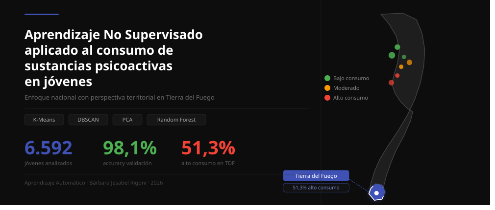

 

 # Informe Final

**Título:** Aprendizaje No Supervisado aplicado al consumo de sustancias psicoactivas en jóvenes: un enfoque Nacional con perspectiva territorial en Tierra del Fuego  
**Alumna:** Bárbara Jesabel Rigoni  
**Profesor:** Nicolás Caballero  
**Materia:** Aprendizaje Automático  
**Año:** 2026  

---

## Índice

1. [Contexto y Relevancia del Problema](#1-contexto-y-relevancia-del-problema)
2. [Objetivo General y Específicos](#2-objetivo-general-y-específicos)
3. [Tipo de Problema](#3-tipo-de-problema)
4. [Fuentes de Datos](#4-fuentes-de-datos)
5. [Descripción del Dataset](#5-descripción-del-dataset)
6. [Variables Seleccionadas](#6-variables-seleccionadas)
7. [Preprocesamiento](#7-preprocesamiento)
8. [Análisis Exploratorio de Datos (EDA)](#8-análisis-exploratorio-de-datos-eda)
9. [Modelado — K-Means](#9-modelado--k-means)
10. [Modelado — DBSCAN](#10-modelado--dbscan)
11. [Visualización mediante PCA](#11-visualización-mediante-pca)
12. [Análisis de Outliers](#12-análisis-de-outliers)
13. [Interpretación de Variables](#13-interpretación-de-variables)
14. [Validación mediante Random Forest](#14-validación-mediante-random-forest)
15. [Comparación TDF vs Nacional](#15-comparación-tdf-vs-nacional)
16. [Análisis Comparativo Temporal 2011–2022](#16-análisis-comparativo-temporal-20112022)
17. [Conclusiones Finales](#17-conclusiones-finales)

---

## 1. Contexto y Relevancia del Problema

El consumo de sustancias psicoactivas en adolescentes y jóvenes constituye uno de los principales problemas de salud pública en Argentina. Según la Encuesta Nacional sobre Prevalencias de Consumo de Sustancias Psicoactivas (ENPreCoSP 2011), el 75,7% de los jóvenes de 16 a 24 años consumió alcohol alguna vez en su vida, el 44,8% tabaco y el 10,8% marihuana, configurando un panorama que demanda herramientas de identificación temprana de perfiles de riesgo.

> **Nota conceptual:** Las *sustancias psicoactivas* es un término amplio que incluye toda sustancia que afecta el sistema nervioso central: alcohol, tabaco, drogas ilegales (marihuana, cocaína, pasta base) y también psicofármacos. Los *psicofármacos* son un subgrupo de sustancias psicoactivas: medicamentos de uso psiquiátrico como tranquilizantes y estimulantes, relevados en este dataset cuando fueron consumidos sin indicación médica (`P1A_TR`, `P1A_ES`).

La Provincia de Tierra del Fuego, Antártida e Islas del Atlántico Sur presenta características sociodemográficas particulares —aislamiento geográfico, alta migración interna, elevado costo de vida y escasa oferta de actividades recreativas— que la distinguen del resto del país. Los datos disponibles indican que los jóvenes fueguinos presentan prevalencias de consumo superiores a la media nacional: 82,6% en alcohol (vs. 75,7% nacional), 62,3% en tabaco (vs. 44,8%) y 21,5% en marihuana (vs. 10,8%).

A diferencia de los enfoques tradicionales que imponen categorías de riesgo predefinidas, este proyecto propone aplicar técnicas de Aprendizaje No Supervisado para descubrir, de manera objetiva, los perfiles naturales de consumo presentes en la población joven argentina, permitiendo identificar agrupamientos naturales a partir de las similitudes presentes en los datos, sin sesgos previos.

---

## 2. Objetivo General y Específicos

### Objetivo General

Identificar automáticamente perfiles de consumo de sustancias psicoactivas en jóvenes de entre 16 y 24 años de Argentina, por medio de técnicas de Aprendizaje No Supervisado, y analizar comparativamente los patrones identificados en la Provincia de Tierra del Fuego respecto del resto del país.

### Objetivos Específicos

1. Explorar y preprocesar los datos de la ENPreCoSP 2011, filtrando el grupo etario de 16 a 24 años a nivel nacional y el subconjunto de Tierra del Fuego (`PRVNC = 94`).
2. Aplicar el algoritmo K-Means para descubrir grupos naturales de jóvenes según sus perfiles de consumo y características sociodemográficas, determinando el número óptimo de clusters mediante el método del codo y el coeficiente de Silhouette.
3. Aplicar el algoritmo DBSCAN para validar los grupos encontrados por K-Means y detectar jóvenes con perfiles atípicos (outliers).
4. Aplicar PCA como herramienta de visualización para representar gráficamente la distribución de los jóvenes en un espacio de menor dimensión.
5. Interpretar y caracterizar cada perfil descubierto mediante tres métodos complementarios: comparación de medias, cargas del PCA y dispersión de centroides.
6. Validar la significatividad de los clusters mediante Random Forest.
7. Comparar los perfiles identificados a nivel nacional con los patrones observados en el subconjunto de Tierra del Fuego.
8. Comparar tendencias con los datos de la ENCoPraC 2022 para contextualizar la evolución del consumo entre 2011 y 2022.

---

## 3. Tipo de Problema

El problema se define como un problema de **Aprendizaje No Supervisado**, específicamente de **clustering o agrupamiento**. A diferencia del aprendizaje supervisado, en este enfoque no existe una variable objetivo predefinida. El modelo descubre por sí solo los grupos naturales presentes en los datos.

Este enfoque es adecuado porque:
- Evita el sesgo de imponer categorías de riesgo predefinidas
- Permite descubrir perfiles complejos y multidimensionales
- Facilita la identificación de grupos vulnerables no evidentes
- Genera hipótesis nuevas sobre los factores asociados al consumo

---

## 4. Fuentes de Datos

### Dataset Principal — ENPreCoSP 2011

| Campo | Detalle |
|---|---|
| **Nombre** | Encuesta Nacional sobre Prevalencias de Consumo de Sustancias Psicoactivas |
| **Organismo** | INDEC / Ministerio de Salud / SEDRONAR |
| **Período de relevamiento** | Agosto–octubre de 2011 |
| **Fuente** | https://www.indec.gob.ar/ftp/cuadros/menusuperior/enprecosp/bases_enprecosp2011.rar |
| **Formato** | Texto plano delimitado por pipes (`\|`) |
| **Licencia** | Dominio público |

### Dataset Complementario — ENCoPraC 2022

| Campo | Detalle |
|---|---|
| **Nombre** | Encuesta Nacional sobre Consumos y Prácticas de Cuidado |
| **Organismo** | SEDRONAR / INDEC |
| **Año** | 2022 |
| **Fuente** | https://www.indec.gob.ar/ftp/cuadros/menusuperior/encoprac/base_usuario_encoprac2022.zip |
| **Uso** | Comparación temporal de prevalencias 2011–2022 |

---

## 5. Descripción del Dataset

### Dimensiones generales

| Característica | Dataset completo | Jóvenes 16-24 años | Subconjunto TDF |
|---|---|---|---|
| Instancias | 34.343 | 6.592 | 265 |
| Variables | 291 | 291 | 291 |
| Codificación | Latin-1 | Latin-1 | Latin-1 |
| Separador | pipe (`\|`) | pipe (`\|`) | pipe (`\|`) |

### Perfil del subconjunto de trabajo

| Variable | Distribución |
|---|---|
| Sexo | Varón: 3.169 (48,1%) \| Mujer: 3.423 (51,9%) |
| Edad promedio | 20,1 años (mín: 16, máx: 24) |
| Alcohol último año | 4.444 consumidores (67,4%) |
| Tabaco último año | 2.139 consumidores (32,4%) |
| Marihuana último año | 283 consumidores (4,3%) |
| Cocaína último año | 61 consumidores (0,9%) |
| Pasta base último año | 4 consumidores (0,1%) |
| Tranquilizantes último año | 74 consumidores (1,1%) |

---

## 6. Variables Seleccionadas

### Variables para el clustering (15 variables finales)

| Variable | Descripción | Categoría |
|---|---|---|
| `BHCH04` | Sexo | Sociodemográfica |
| `BHCH05` | Edad en años cumplidos | Sociodemográfica |
| `NIVINSTR` | Nivel de instrucción | Sociodemográfica |
| `CONDACT` | Condición de actividad | Sociodemográfica |
| `TIPO_H` | Tipo de hogar | Contexto familiar |
| `NBI_TOTAL` | Necesidades Básicas Insatisfechas | Contexto familiar |
| `RANGOING` | Rango de ingreso del hogar | Contexto familiar |
| `BISG01` | Autopercepción de salud general | Salud y entorno |
| `BISG04` | Visita a profesional de salud mental | Salud y entorno |
| `BIAC01` | Conoce consumidores cercanos | Salud y entorno |
| `BIAC03` | Curiosidad por probar drogas | Salud y entorno |
| `BIAC04` | Posibilidad de acceso a drogas | Salud y entorno |
| `REGION` | Región estadística del país | Territorial |
| `POB_URB` | Tamaño del aglomerado urbano | Territorial |
| `PRVNC` | Provincia de residencia | Territorial |

> La selección está fundamentada en los factores de riesgo documentados por **MedlinePlus (NIH)** y el **Observatorio Argentino de Drogas (SEDRONAR)**: antecedentes familiares de adicción, trastornos de salud mental, presión de grupo, falta de implicación familiar, consumo en edad temprana y acceso a sustancias.

### Variables de consumo (análisis descriptivo)

| Variable | Descripción |
|---|---|
| `P1A_BA` | Bebidas Alcohólicas |
| `P1A_TA` | Tabaco | 
| `P1A_MA` | Marihuana |
| `P1A_CO` | Cocaína |
| `P1A_PB` | Pasta Base |
| `P1A_TR` | Tranquilizantes |

---

## 7. Preprocesamiento

El preprocesamiento se realizó en 6 pasos:

| Paso | Acción | Resultado |
|---|---|---|
| 1 | Selección de variables | 16 variables seleccionadas |
| 2 | Eliminación de BIAC02 | 60% nulos — variable redundante con BIAC01 |
| 3 | Detección de códigos NS/NC | 5 variables afectadas (9, 99 según diccionario) |
| 4 | Reemplazo NS/NC por NaN | 567 valores tratados |
| 5 | Imputación | Mediana para RANGOING, moda para el resto |
| 6 | Normalización (StandardScaler) | Media=0, Std=1 en todas las variables |

> Como resultado de este proceso se obtuvo un conjunto de datos limpio, consistente y sin valores faltantes, apto para la aplicación de los algoritmos de clustering.
> > **Dataset final:** 6.592 registros × 14 variables (sin `PRVNC`) para el modelado.

---

## 8. Análisis Exploratorio de Datos (EDA)

### **Perfil sociodemográfico:**

  ### Interpretación

La distribución de la muestra presenta un equilibrio entre mujeres (51,9%) y varones (48,1%), mientras que las edades se distribuyen de manera relativamente uniforme entre los 16 y los 24 años. Esta composición resulta favorable para el análisis, ya que reduce el riesgo de que los resultados estén fuertemente condicionados por un predominio de un sexo o de una edad específica dentro de la población estudiada. En consecuencia, las diferencias observadas en etapas posteriores podrán interpretarse con mayor énfasis en función de las variables analizadas y no como un efecto de la estructura demográfica de la muestra.

### **Consumo de sustancias — Nacional vs TDF:**

| Sustancia | Nacional | TDF | Diferencia |
|---|---|---|---|
| Alcohol | 67,4% | 73,6% | +6,2% |
| Tabaco | 32,4% | 40,0% | +7,6% |
| Marihuana | 4,3% | 6,0% | +1,7% |

### Interpretación

El análisis descriptivo muestra que Tierra del Fuego presenta prevalencias de consumo superiores al promedio nacional para las tres sustancias consideradas. Las mayores diferencias se observan en alcohol y tabaco, mientras que el consumo de marihuana también registra valores superiores, aunque con una brecha más moderada.

Estos resultados constituyen uno de los primeros indicios de que la población joven fueguina podría presentar un patrón de consumo diferencial respecto del conjunto nacional. No obstante, esta evidencia corresponde a un análisis descriptivo y será complementada posteriormente mediante técnicas de aprendizaje automático que permitan identificar perfiles de comportamiento más complejos.

### **Factores de entorno — Nacional vs TDF:**

| Factor | Nacional | TDF |
|---|---|---|
| Conoce consumidores | 39,6% | 46,0% |
| Curiosidad por drogas | 14,8% | 25,3% |
| Acceso a drogas | 34,8% | 52,1% |

### Interpretación

Las variables relacionadas con el entorno social muestran diferencias relevantes entre Tierra del Fuego y el promedio nacional. En la provincia se observa una mayor proporción de jóvenes que manifiestan conocer personas consumidoras, sentir curiosidad por probar drogas y percibir un acceso más sencillo a estas sustancias.

En conjunto, estos resultados sugieren una mayor exposición al contexto de consumo dentro de la población fueguina. Si bien el análisis descriptivo no permite establecer relaciones causales, estas variables podrían desempeñar un papel importante en la diferenciación de los perfiles identificados durante la etapa de modelado.

### **Perfil educativo y laboral:**

### Interpretación

En comparación con el promedio nacional, Tierra del Fuego presenta una mayor proporción de jóvenes ocupados y una menor proporción de inactivos. Al mismo tiempo, se observa un abandono educativo más temprano dentro de la muestra provincial.

Estos resultados reflejan una dinámica distinta de inserción educativa y laboral, lo que sugiere que el contexto socioeconómico de la provincia posee características particulares que podrían influir en los patrones de consumo observados. Por este motivo, estas variables serán consideradas en la interpretación integral de los clusters obtenidos.

### **Contexto socioeconómico:**

### Interpretación

El análisis del contexto socioeconómico indica que Tierra del Fuego presenta una menor proporción de hogares con Necesidades Básicas Insatisfechas y una concentración significativamente mayor de jóvenes en los niveles de ingresos más altos respecto del promedio nacional.

Este hallazgo resulta especialmente relevante para la investigación, ya que permite evaluar posteriormente si las diferencias observadas en los perfiles de consumo pueden explicarse únicamente por variables económicas o si intervienen otros factores asociados al entorno social y al acceso a sustancias. En este sentido, el análisis posterior de los modelos permitirá profundizar esta interpretación.

### Hallazgos principales del EDA

| Indicador | Nacional | TDF |
|---|---|---|
| Alcohol último año | 67,4% | 73,6% |
| Tabaco último año | 32,4% | 40,0% |
| Marihuana último año | 4,3% | 6,0% |
| Conoce consumidores | 39,6% | 46,0% |
| Curiosidad por drogas | 14,8% | 25,3% |
| Acceso a drogas | 34,8% | 52,1% |
| Ocupados | 45,1% | 59,6% |
| Ingresos altos | 10,4% | 49,1% |

### Interpretación general del EDA

En conjunto, el análisis exploratorio evidencia que Tierra del Fuego presenta diferencias consistentes respecto del promedio nacional en múltiples dimensiones. La provincia registra mayores prevalencias de consumo de sustancias, una mayor exposición a entornos vinculados al consumo y una percepción de acceso más elevada. Al mismo tiempo, muestra mejores indicadores económicos y una mayor participación laboral juvenil.

La coexistencia de estos resultados sugiere que el fenómeno del consumo no puede interpretarse exclusivamente a partir de variables socioeconómicas tradicionales, sino que responde a una combinación de factores individuales, sociales y contextuales. Estos hallazgos justifican la aplicación de técnicas de aprendizaje automático no supervisado para identificar perfiles de comportamiento más complejos que los observables mediante estadísticas descriptivas.

---

## 9. Modelado — K-Means

### Determinación del K óptimo

| K | Inercia | Silhouette |
|---|---|---|
| 2 | 82.400,6 | 0,134 |
| **3** | **76.751,0** | **0,140** ← óptimo |
| 4 | 71.956,2 | 0,099 |
| 5 | 69.028,0 | 0,096 |

El método del codo y el coeficiente de Silhouette coinciden en **K=3** como valor óptimo.

### Perfiles de consumo por cluster

### Resultados K-Means (K=3)

| Cluster | Perfil | Jóvenes | % |
|---|---|---|---|
| 🟢 Cluster 2 | Bajo consumo | 3.963 | 60,1% |
| 🔴 Cluster 1 | Alto consumo | 1.989 | 30,2% |
| 🟡 Cluster 0 | Consumo moderado | 640 | 9,7% |

### Métricas

| Métrica | Valor |
|---|---|
| Coeficiente de Silhouette | 0,140 |
| Índice Davies-Bouldin | 2,387 |

### Prevalencia de consumo por cluster

| Sustancia | Bajo consumo | Moderado | Alto consumo |
|---|---|---|---|
| Alcohol | 57,4% | 68,4% | 87,1% |
| Tabaco | 23,1% | 37,8% | 49,4% |
| Marihuana | 0,2% | 6,4% | 11,8% |
| Cocaína | 0,1% | 2,0% | 2,3% |

---

## 10. Modelado — DBSCAN

### Determinación de eps óptimo

Tras explorar combinaciones de `eps` y `min_samples`, se seleccionó **eps=2.5, min_samples=15** por producir 3 clusters comparables con K-Means y una silueta superior.

### Resultados DBSCAN

| Grupo | Jóvenes | % |
|---|---|---|
| Outliers (perfiles atípicos) | 896 | 13,6% |
| Cluster 0 | 4.862 | 73,8% |
| Cluster 1 | 565 | 8,6% |
| Cluster 2 | 269 | 4,1% |

### Comparación K-Means vs DBSCAN

| Métrica | K-Means | DBSCAN |
|---|---|---|
| Clusters | 3 | 3 |
| Silhouette | 0,140 | **0,155** ✅ |
| Davies-Bouldin | 2,387 | **1,846** ✅ |
| Outliers detectados | 0 | 896 |

> DBSCAN supera a K-Means en ambas métricas y adicionalmente detecta 896 jóvenes con perfiles atípicos.

---

## 11. Visualización mediante PCA

Se aplicó PCA para reducir las 14 variables a 2 componentes principales y visualizar los clusters en 2D.

### Clusters en espacio PCA

### Clusters sin PCA

> El gráfico sin PCA demuestra por qué la reducción de dimensionalidad es necesaria: las variables categóricas forman bandas que dificultan la visualización de los clusters.

| Componente | Varianza explicada |
|---|---|
| PC1 | 14,5% |
| PC2 | 11,4% |
| **Total** | **25,9%** |

> La varianza total del 25,9% es esperable en datos de encuestas sociales de alta dimensionalidad, donde los comportamientos humanos no siguen patrones perfectamente separables.

---

## 12. Análisis de Outliers

DBSCAN identificó **896 jóvenes (13,6%)** con perfiles atípicos.

### Perfil de outliers

### Perfil de outliers vs resto

| Sustancia | Outliers | Resto |
|---|---|---|
| Alcohol | 78,3% | 65,7% |
| Tabaco | 48,4% | 29,9% |
| Marihuana | 9,7% | 3,4% |
| Cocaína | 2,3% | 0,7% |

> Los outliers no son jóvenes con perfiles completamente diferentes, sino jóvenes con **consumo más intenso en múltiples sustancias simultáneamente**. Su distribución dispersa en el espacio PCA confirma que son perfiles diversos y no un grupo homogéneo.

**TDF en outliers:** 38 jóvenes (14,3% de los fueguinos son outliers, vs 13,6% nacional).

---

## 13. Interpretación de Variables

Se aplicaron tres métodos complementarios para identificar las variables más influyentes:

### Comparación de medias por cluster

### Tres métodos comparados

### Ranking consolidado

| Variable | Cargas PC1 | Dispersión centroides | Diferencia de medias |
|---|---|---|---|
| 🥇 **Acceso a drogas** | 1° | 2° | 2° |
| 🥈 **Conoce consumidores** | 2° | 3° | 3° |
| 🥉 **Curiosidad drogas** | 3° | 4° | 5° |
| **Ingreso hogar** | 4° | 7° | 1° |
| **Salud mental** | 13° | 1° | 14° |

> Las variables de **entorno social** (acceso a drogas, conocer consumidores, curiosidad) son consistentemente las más influyentes en todos los métodos, por encima de variables socioeconómicas como NBI o tipo de hogar.

---

## 14. Validación mediante Random Forest

Se entrenó un modelo Random Forest usando los clusters de K-Means como variable objetivo para validar su significatividad.

### Matriz de confusión e importancia de variables

### Resultados

| Métrica | Valor |
|---|---|
| **Accuracy** | **98,1%** |
| Precision (macro) | 0,98 |
| Recall (macro) | 0,98 |
| F1-score (macro) | 0,98 |

### Importancia de variables (Random Forest)

| Ranking | Variable | Importancia |
|---|---|---|
| 🥇 | Acceso a drogas | ~0,38 |
| 🥈 | Salud mental | ~0,25 |
| 🥉 | Conoce consumidores | ~0,11 |
| 4° | Curiosidad drogas | ~0,06 |
| 5° | Ingreso hogar | ~0,04 |

> Un accuracy del 98,1% confirma que los clusters son **altamente significativos** y no aleatorios. Los perfiles de consumo descubiertos reflejan patrones reales y consistentes en los datos.

---

## 15. Comparación TDF vs Nacional

### Distribución de clusters Nacional vs TDF

| Indicador | Nacional | Tierra del Fuego |
|---|---|---|
| 🟢 Bajo consumo | 60,1% | 41,1% |
| 🟡 Consumo moderado | 9,7% | 7,5% |
| 🔴 Alto consumo | 30,2% | **51,3%** |

> **Hallazgo central:** mientras que a nivel nacional 3 de cada 10 jóvenes pertenecen al grupo de alto consumo, en Tierra del Fuego esa proporción asciende a más de **5 de cada 10**.

---

## 16. Análisis Comparativo Temporal 2011–2022

### Evolución del consumo 2011 vs 2022

| Sustancia | 2011 | 2022 | Cambio |
|---|---|---|---|
| 🍺 Alcohol | 67,4% | 70,2% | ↑ +2,8% |
| 🚬 Tabaco | 32,4% | 22,9% | ↓ -9,5% |
| 🌿 Marihuana | 4,3% | 17,4% | ↑↑ **+13,1%** |
| 💊 Tranquilizantes | 1,1% | 2,7% | ↑ +1,6% |

El aumento de marihuana del 4,3% al 17,4% —prácticamente cuadruplicándose— coincide temporalmente con la sanción de la **Ley 27.350** de uso medicinal del cannabis (2017) y la posterior reglamentación del autocultivo (2020).

> **Nota metodológica:** esta comparación es parcial. La ENCoPraC 2022 no permite desagregación provincial y solo 4 de las 15 variables predictoras tienen equivalente directo entre ambas encuestas.

---

## 17. Conclusiones Finales

### 1. Sobre los perfiles de consumo descubiertos

K-Means (K=3) y DBSCAN identificaron tres perfiles naturales de consumo en jóvenes argentinos de 16 a 24 años:

| Perfil | Proporción | Características |
|---|---|---|
| 🟢 **Bajo consumo** | 60,1% | Consumo moderado de alcohol, muy bajo de otras sustancias |
| 🔴 **Alto consumo** | 30,2% | Alcohol (87,1%), tabaco (49,4%), marihuana (11,8%) |
| 🟡 **Consumo moderado** | 9,7% | Alcohol y tabaco, sin sustancias ilícitas |

> ✅ La validación mediante Random Forest alcanzó un accuracy del **98,1%**, confirmando que los clusters son significativos y no aleatorios.

### 2. Sobre los factores más influyentes

Los tres métodos de interpretación coincidieron en los mismos factores:

| Ranking | Factor | Interpretación |
|---|---|---|
| 🥇 | **Acceso a drogas** | El factor más determinante en todos los métodos |
| 🥈 | **Conocer consumidores cercanos** | La presión del entorno social |
| 🥉 | **Curiosidad por probar drogas** | La predisposición personal |
| 4° | **Ingreso del hogar** | El nivel económico facilita el acceso |

> Las variables socioeconómicas tradicionales como NBI y tipo de hogar resultaron poco influyentes, sugiriendo que el consumo en jóvenes está más asociado al **entorno social** que a la pobreza.

### 3. Sobre el perfil específico de Tierra del Fuego

| Indicador | Nacional | Tierra del Fuego |
|---|---|---|
| Cluster de alto consumo | 30,2% | **51,3%** |
| Alcohol (último año) | 67,4% | **73,6%** |
| Tabaco (último año) | 32,4% | **40,0%** |
| Marihuana (último año) | 4,3% | **6,0%** |
| Conoce consumidores | 39,6% | **46,0%** |
| Acceso percibido a drogas | 34,8% | **52,1%** |

> A pesar de mejores condiciones económicas, los jóvenes fueguinos presentan mayor consumo. El aislamiento geográfico, la mayor disponibilidad de ingresos y la alta exposición social son factores de riesgo específicos del territorio.

### 4. Sobre la evolución temporal 2011–2022

| Sustancia | 2011 | 2022 | Tendencia |
|---|---|---|---|
| 🍺 Alcohol | 67,4% | 70,2% | ↑ +2,8% |
| 🚬 Tabaco | 32,4% | 22,9% | ↓ -9,5% |
| 🌿 Marihuana | 4,3% | 17,4% | ↑↑ **+13,1%** |
| 💊 Tranquilizantes | 1,1% | 2,7% | ↑ +1,6% |

> El aumento de marihuana coincide con la sanción de la **Ley 27.350** (2017) y la reglamentación del autocultivo (2020).

### 5. Limitaciones del estudio

**Limitaciones del modelo:**
- El coeficiente de Silhouette (0,140) es bajo, aunque esperable cuando se trabaja con comportamientos humanos. Como señala **Rousseeuw (1987)**, las conductas sociales no se dividen en grupos nítidos: las personas no encajan perfectamente en categorías, y esa superposición no es un error del método sino un reflejo de los fenómenos sociales.
- DBSCAN identificó 896 jóvenes (13,6%) como outliers. Su distribución dispersa sugiere perfiles diversos y no un grupo homogéneo, lo que limita su interpretación.

**Limitaciones del dataset:**
- El subconjunto de TDF es reducido (N=265), lo que implica mayor margen de error en las estimaciones territoriales.
- El dataset ENPreCoSP 2011 tiene 13 años de antigüedad, aunque la comparación con ENCoPraC 2022 permite contextualizar parcialmente esta limitación.

**Limitaciones de la comparación temporal:**
- La ENCoPraC 2022 no incluye variable de provincia, lo que impide reproducir el análisis territorial.
- Solo 4 de las 15 variables predictoras tienen equivalente directo en 2022, acotando la comparación exclusivamente a prevalencias de consumo.

### 6. Recomendaciones y futuras líneas de investigación

**Futuras líneas de investigación:**

> **Incorporación de variables de salud mental:** La variable BISG04 fue prácticamente irrelevante (diferencia de medias: 0,005), aunque esto dice más sobre los límites del indicador que sobre la relación entre salud mental y consumo. Futuras investigaciones deberían incorporar variables de ansiedad, depresión y estrés percibido.

> **Extensión a provincias con perfil similar:** ¿Es Tierra del Fuego un caso aislado, o parte de algo más grande? Neuquén, Santa Cruz y Chubut comparten las mismas características identificadas como factores de riesgo. Si el patrón se repite, estaríamos ante un **fenómeno patagónico**.

> **Análisis longitudinal:** El presente estudio posee un diseño transversal, por lo que permite describir la distribución observada en un momento determinado, pero no establecer trayectorias individuales ni relaciones causales.

---

## Aporte del Trabajo

> Este trabajo demuestra que las técnnicas de aprendizaje automático no supervisado pueden aplicarse al análisis de fenómenos sociales complejos, permitiendo identificar perfiles de comportamiento que no resultan evidentes mediante estadísticas descriptivas tradicionales. La comparación entre Tierra del Fuego y el promedio nacional aporta una perspectiva territorial que evidencia la importancia de analizar realidades locales y no únicamente indicadores agregados. En este sentido, los resultados obtenidos constituyen una herramienta exploratoria que puede orientar futuras investigaciones y contribuir al diseño de estrategias de prevención basadas en evidencia.
>

---

## Referencias

- INDEC / Ministerio de Salud (2011). *ENPreCoSP 2011 — Encuesta Nacional sobre Prevalencias de Consumo de Sustancias Psicoactivas*. Buenos Aires: INDEC.
- SEDRONAR / INDEC (2022). *ENCoPraC 2022 — Encuesta Nacional sobre Consumos y Prácticas de Cuidado*. Buenos Aires: SEDRONAR.
- MedlinePlus / NIH (2025). *Trastorno de consumo de drogas — Factores de riesgo*. Disponible en: medlineplus.gov
- Rousseeuw, P.J. (1987). *Silhouettes: a graphical aid to the interpretation and validation of cluster analysis*. Journal of Computational and Applied Mathematics, 20, 53–65.
- Observatorio Argentino de Drogas — SEDRONAR. *Informes de prevalencias de consumo en población joven*.

---

*Materia: Aprendizaje Automático | Alumna: Bárbara Jesabel Rigoni | Profesor: Nicolás Caballero | 2026*
